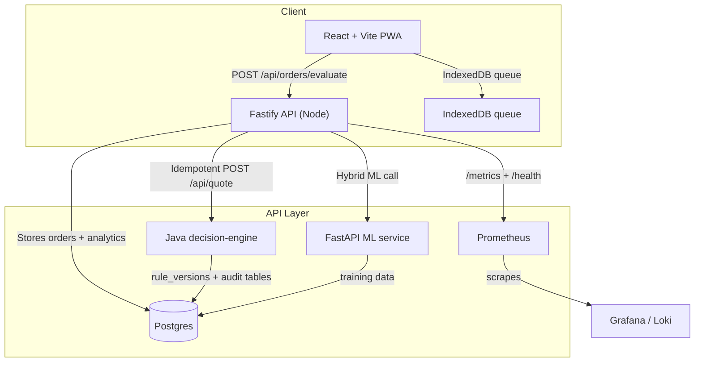

# DoorDash Order Decider
[](https://github.com/josuejero/DoorDashOrderDecider/actions/workflows/ci.yml)
[](https://github.com/josuejero/DoorDashOrderDecider/actions/workflows/ci.yml)
[](https://github.com/josuejero/DoorDashOrderDecider/actions/workflows/ci.yml)
[](https://github.com/josuejero/DoorDashOrderDecider/actions/workflows/ci.yml)
[](LICENSE)
[](#)
[](https://doordash-order-decider.vercel.app/)

## What it does
DoorDash Order Decider turns the fast, fuzzy world of gig delivery into a reproducible decision flow: feed it an offer, compute net hours with deterministic and optional ML-assisted rules, persist the decision, and carry the explanation through every stack layer.

**Disclaimer:** Independent portfolio project; not affiliated with DoorDash. Offers are entered manually and data lives in your own Postgres instance or analytics exports.

---

## Architecture
The repo stitches together an offline-first React PWA, a Fastify API that validates + logs every quote, a Java-based decision engine for production-ready rules, and an optional FastAPI ML service that enriches the heuristic score. The API surfaces metrics, audit tables, and OpenAPI docs while Postgres holds the operational + analytics state.



## Quickstart
```bash
npm install && python -m venv .venv && . .venv/bin/activate && pip install -r ml_service/requirements.txt
npm run db:migrate && npm run db:seed
npm run dev:server
```

Before running migrations, set `DD_DECIDER_DEV_DB_URL` and `DD_DECIDER_TEST_DB_URL` (see the config table below). Once the backend is listening, fire up the frontend via `npm run dev` in another shell and optionally start the ML service with `uvicorn ml_service.main:app --reload --host 0.0.0.0 --port 8000` if you need `hybrid_ml` mode.

## Local services
- `npm run dev` – Vite dev server for the PWA (default `http://localhost:5173`).
- `uvicorn ml_service.main:app --reload --host 0.0.0.0 --port 8000` – lightweight FastAPI predictor.
- `docker compose -f docker-compose.yml up --build` – spins up the full stack (frontend, backend, Postgres, ML, analytics, Prometheus/Grafana) when you want a single command deployment.

## Decision engine design
### Strategies
`decision-engine/src/main/java/com/doordash/decider/engine/strategy/QuoteStrategy.java` defines the contract, and `SimpleHeuristicStrategy` implements a single-pass heuristic that rounds time windows, subtracts cost-per-mile, compares net/hour to acceptance and rejection thresholds, and emits a list of `ExplanationNode` objects so clients can render the explanation tree.

### Rule versioning
Rules are JSON seeds under `decision-engine/src/main/resources/rulesets`. Each seed maps to a `RuleVersion` record stored in the `rule_versions` table (`decision-engine/src/main/resources/db/migration/V1__init.sql`). `MarketRuleSeedLoader` loads these on startup, `RulesResolver` picks the latest enabled version per `rulesetKey`, and every response surface the `ruleVersion`/`rulesetKey` pair so callers know exactly which knobs generated the quote.

### Idempotency
Both Fastify (`server/routes/quote.ts`) and the Java engine honor an `Idempotency-Key` header (and an optional body field) so retries reuse the same `quoteId`. Duplicate detection increments `decision_engine.quote.idempotency_hits` (`decision-engine/src/main/java/com/doordash/decider/audit/QuoteAuditMetrics.java`) and the API mirrors the key into the response.

### Audit trail tables
Every quote is audited via three tables (`quote_requests`, `quote_results`, `quote_assumptions` in `decision-engine/src/main/resources/db/migration/V1__init.sql`). Requests store the raw payload plus `correlationId`/`idempotency_key`, results hold the flattened decision JSON and `rule_version`, and assumptions sink the explanation tree so you can rebuild the reasoning for every driver interaction.

## Debugging story
Given `quoteId = 345e2c2a-9ea6-4cfc-bf3e-d9a37a17d7a9`, start by querying `quote_requests` to replay the input payload, `correlationId`, and `idempotency_key`. Use the same `quoteId` to read `quote_results` for the persisted decision, `rule_version`, and the `decision_payload` that the UI renders. `quote_assumptions` lists the `explanationTree` nodes you can line up with the frontend tree UI; the joined `rule_versions` row reveals the exact `enableHybridMl`, cost, threshold, and rounding knobs that were applied. If you need to tie logs to the call, grep the Fastify logs by the correlation ID emitted from `server/routes/quote.ts` (Fastify injects it via `server/app.ts`), which also appears in the returned payload.

## Why this exists
- Delivery offers are evaluated under time pressure with incomplete data; this repo codifies the mental math into reusable rules and explanations.
- Heuristic mode keeps everything offline-friendly while hybrid ML gives you a soft blend when the FastAPI predictor is enabled.
- Analytics + observability ensure every decision can be reviewed, traced, and retrained.

## Key features
- **Decision engine** shared across UI, Fastify, and the Java reasoning service; emits decisions, reason codes, and explanation trees that the frontend can render even offline.
- **Two modes** (`heuristic`, `hybrid_ml`) with toggleable ML confidence and fallback heuristics inside `SimpleHeuristicStrategy`.
- **Offline-first UX** with IndexedDB queues, Vite + Workbox caching, and inline explanations.
- **Analytics flow** writes into analytics fact tables, syncs with Postgres, and feeds dashboards.
- **Observability** via `/metrics`, Prometheus, and correlation IDs tracked through Fastify and the Java service.

## Tech stack
**Frontend** – React + TypeScript + Vite, Vitest, Playwright, IndexedDB queue, explanation tree UI (see docs/assets).

**Backend** – Fastify + Zod, Postgres + node-pg-migrate, Prometheus metrics (`prom-client`), `server/metrics.ts` tracks `http_request_duration_seconds`.

**ML service** – FastAPI + Pydantic, `ml_service/main.py`, optional hybrid scoring, retraining scripts under `ml_service/train.py`.

**Decision engine** – Spring Boot + Micrometer, custom strategies, `rule_versions` seeding, and OpenAPI docs under `decision-engine/src/test/resources/openapi-golden.json`.

**Infra** – Docker Compose, Kubernetes (Kustomize + OpenTofu + Helm) for full-stack deployments and observability.

## Docs & snapshots
- `docs/architecture.md` – system overview and devops touchpoints.
- `docs/api.md` – quote contract, errors, observability notes, and request/response examples.
- `docs/rules.md` – how rule versions are created, seeded, and selected at runtime.
- `docs/observability.md` – metrics, correlation IDs, and what to watch.
- `docs/incidents/2025-02-08-quote-service-backpressure.md` – short incident report for tracing behavior.
- OpenAPI snapshot: `decision-engine/src/test/resources/openapi-golden.json` (source of swagger UI shown below).

## Visual assets
- Explanation tree UI – `docs/assets/explanation-tree-ui.svg` shows the tree layout the frontend consumes.
- Swagger UI page – `docs/assets/swagger-ui.svg` illustrates the Java decision-engine docs.

## Decision engine service
A standalone Spring Boot service (`decision-engine/`) exposes `POST /quote`, `/actuator/health`, `/actuator/prometheus`, and Swagger UI (`/swagger-ui.html`).

### Build & run
```bash
cd decision-engine
./gradlew bootRun
```

### Surface area
* `GET http://localhost:8080/actuator/health`
* `GET http://localhost:8080/actuator/prometheus`
* `GET http://localhost:8080/swagger-ui.html`
* `GET http://localhost:8080/v3/api-docs`
* `POST http://localhost:8080/quote`

### Quote contract example
```json
{
  "offerId": "offer-123",
  "driverId": "driver-xyz",
  "payout": 32.5,
  "distanceMiles": 4.5,
  "estimatedMinutes": 17,
  "targetHourlyRate": 28.0,
  "availableMinutes": 30
}
```
_(Documented in `decision-engine/src/main/java/com/doordash/decider/api/dto/QuoteResponse.java` and the OpenAPI snapshot above.)_

## Repo layout
* `src/` – React app + shared decision logic (`src/lib/decision.*`).
* `server/` – Fastify API, analytics, db access, metrics, correlation handling.
* `ml_service/` – FastAPI ML microservice (predict + metadata + training).
* `decision-engine/` – Java quote service with rule seeding, Micrometer metrics, audit tables, idempotency handling.
* `migrations/` – Postgres schema + analytics tables (`node-pg-migrate`).
* `infra/` – Dockerfiles, Kubernetes (Kustomize), Terraform/OpenTofu + Helm.
* `e2e/` – Playwright end-to-end tests.

## Configuration
| Variable | Default | Purpose |
| --- | --- | --- |
| `DD_DECIDER_API_PORT` | `4000` | backend port |
| `DD_DECIDER_DEV_DB_URL` | `postgres://localhost:5432/doordash_decider_dev` | dev database |
| `DD_DECIDER_TEST_DB_URL` | `postgres://localhost:5432/doordash_decider_test` | test database |
| `ENABLE_ANALYTICS_API` | `true` | toggle analytics routes |
| `ENABLE_HYBRID_ML` | `false` | allow calling the FastAPI predictor |
